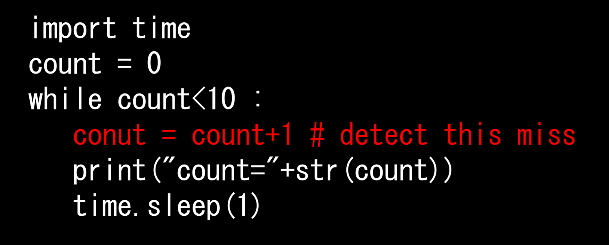

# hiPyCheck : 勝手な変数導入を抑止する

### type-hintのある代入文を変数定義と見做し、定義の無い変数への代入をエラーとする
```
  count:int=0  # type-hintがあると変数定義と見做す
  while count < 19 :
     conut = count+1 # 定義されていない'conut'への代入はエラー

「変数定義が不要で代入文で勝手に変数が定義される」という危険極まりない仕様によるバグを避けるために作成されました。
極めて単純なチェックしか行いません。代入以外は実行時のチェックに任されます。それでも、開発効率は圧倒的に高まります。
現状のPythonの文法の中で行っており、hiPyCheckにかけた.pyはそのままpythonとして動作します。
```
### スコープは入れ子式。スコープ内の重複は不可
```
  def func1():
     x:int=2
     if a==0 :
        x=3      # OK. 定義済みx参照
        y:int=5  # OK.
        z=7      # ERR. 定義なし
        # なんだかんだ
     else:
        x:int=13 # ERR. 定義済みxと衝突
        y:int=17 # OK. if(a==0){..}とは別スコープ
        # どうしたこうした
     y:int=19    # ERR. func1スコープで入れ子のyと衝突
  def func2():
     x:int=23    # OK. func1とは別スコープ
     # それやこれや
```
### クラス内ではselfスコープがある。defをまたいで有効
```
   class A(B):
      def __init__(self, *args, **kwargs):
         super().__init__(*args, **kwargs)
         self.x:int=2
         self.y:int=3
      def func1()
         self.x=5     # OK  initで定義されている
         self.y:int=7 # ERR initで定義済み
         self.z=13    # ERR 定義なし
```
### DEF内でのGLOBAL変数への代入はエラーとする
```
   a:int=5 # 変数定義
   def func():
      a = 10 # ERR GLOBAL変数への代入
   def fuc2() :
      global a
      a = 10 # OK
```
### チェックしない代入文
```
   # .(ドット）修飾の変数はチェックしない
   a:A=A()
   a.x=1   # チェックしない
   # クラス変数はチェックしない
   class B:
      y=2  # チェックしない
```
### フォルダ・ビルド・実行
```
次のフォルダ構成となっています
$ tree hiPyCheck
hiPyCheck
|-- bin
|   |-- hiPyCheck          # A01_build.shで作成
|   `-- hiPyCheck.jar      # A01_build.sh/B01_build.batで作成
|-- run_this_to_set755.sh  # Linuxで.shに実行フラグを付ける
|-- src
|   |-- A00_fullClean.sh
|   |-- A01_build.sh       # ビルドスクリプト(Linix/bash)
|   |-- B00_fullClean.bat
|   |-- B01_build.bat      # ビルドスクリプト(Windows)
|   |-- hiNote_3_10.jar    # 基本ライブラリ
|   `-- hiPyCheck.java     # ソースコード
`-- test
    |-- A10_test.sh        # 試験
    |-- B10_test.bat       # 試験
    |-- defScopes.py
    |-- globalScope.py
    |-- kekka.ref          # 試験結果リファレンス
    |-- kekka.txt
    |-- nestScope.py
    |-- selfScope.py
    `-- simple.py

=== ビルド法
Linuxの場合sh run_this_to_set755.shを実行すると、他の.shに実行フラグが付加されます。

src/下でA01_build.sh(Linuxの場合）、B01_build.bat(Windowsの場合）を実行すると
bin/下にhiPyCheck.jarが作成されます。
Linuxの場合bin/下に実行プログラムhiPyCheckも作成されます。

=== チェック実行
コマンド形式：
  java -jar hiPyCheck .pyファイル [.pyファイル...] [オプション]
  hiPyCheck .pyファイル [.pyファイル...] [オプション] (Linuxの場合）
.pyファイルは複数指定可能です
オプションは次のものとなります。
    -terse   : ファイル名、エラー数を表示しない
    -err 数  : 指定数以上のエラーで処理を終了する
    -no_tent : デフォルトでは未定義変数への代入時には
               エラーを表示した上で、仮の変数定義を行う
               本指定がある場合仮の変数定義は行わない
    -step    : 有意の各行に対して解釈を表示する
    -verbose : 解析中の情報を表示する

```
